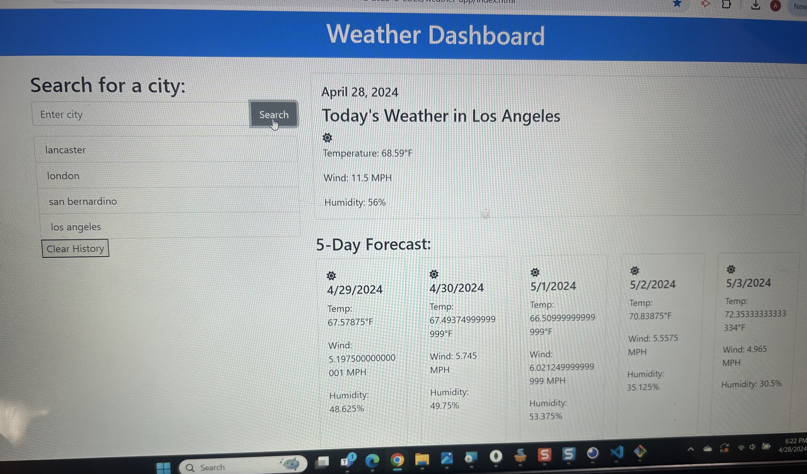

# Weather Dashboard 

## Description
The Weather Dashboard is an application designed to reveal current-time and future-time weather updates. This weather dashboard combines simplicity and functionality, enabling users to effortlessly access current weather conditions and for the next 5 days for any city.

## User story
AS A traveler
I WANT to see the weather outlook for multiple cities
SO THAT I can plan a trip accordingly

## Acceptance Criteria
GIVEN a weather dashboard with form inputs
WHEN I search for a city
THEN I am presented with current and future conditions for that city and that city is added to the search history
WHEN I view current weather conditions for that city
THEN I am presented with the city name, the date, an icon representation of weather conditions, the temperature, the humidity, and the the wind speed
WHEN I view future weather conditions for that city
THEN I am presented with a 5-day forecast that displays the date, an icon representation of weather conditions, the temperature, the wind speed, and the humidity
WHEN I click on a city in the search history
THEN I am again presented with current and future conditions for that city

## Links
Deployed Application:https://watsonaj0316.github.io/weather-app/ 

Repo: https://github.com/Watsonaj0316/weather-app 

## Screenshot
 

## Setup and Installation
Clone the repository to your local machine: 
git@github.com:Watsonaj0316/weather-app.git

## Usage
☺ HTML - For structuring the web content
CSS - For styling and responsive design
JavaScript - For dynamic interactions and API integration
Bootstrap - For additional styling and responsiveness
OpenWeather API - For fetching real-time weather data

## License
This project is licensed under the ISC license.

